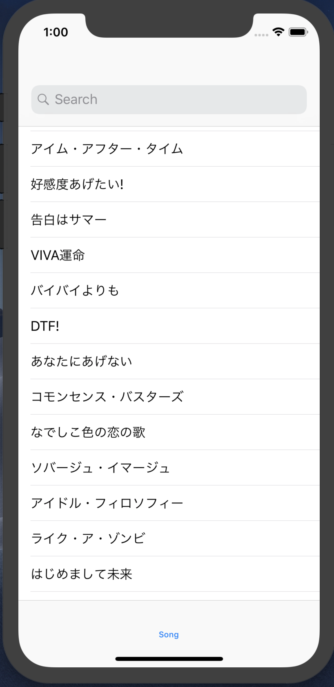
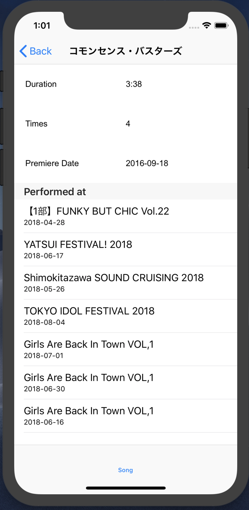

# ごあいさつ

このたびはLIDDELL開発部「インフルエンサーマーケティングを支える技術」をお買い上げいただき、誠にありがとうございます。  
本ページは当該書籍 第1章「グラフデータベースNeo4jとGraphQLで作る、お手軽・本格Web API！」の補足ページです。  

## iOSプロジェクトのおためし方法

本誌では割愛してしまった、本稿のクライアント実装(iOS)は以下の手順でお試しいただけます。

### ベーシック認証の値を取得

[このサイト](https://www.blitter.se/utils/basic-authentication-header-generator/)などを利用し、データベースの`ユーザ名(デフォルトは"neo4j")`と`パスワード(自身で設定した値)`から成る値を取得します。

### 値をセット

`SongListViewController`の`YOUR_TOKEN`の部分を、先ほど取得した値`(Basic xxxxx)`で置き換えます。

### データベースに対するスキーマ・データの設定

#### 初期設定

本文にならい、`Neo4j`を用意します。
`GraphQL Plugin`のインストールも忘れずに行います。

#### スキーマの設定

`Neo4j Desktop`のweb browserを起動し、`schema.graphql`のデータを引数に渡した以下のコマンドを実行します。 
**書籍のコード(リスト1.6)と異なっております。ご注意ください。**  
既に書籍のスキーマをデータベースに設定してしまっておりそちらを消したい、といった場合、`Neo4j Desktop`のweb browserで  
  
`call graphql.idl(null)`

と入力すれば削除できますので、改めて以下のコマンドを実行してください。

```
call graphql.idl('type Group {
    id: ID!
    name: String!
    composedIn: Int
    songs: [Song] @relation(name: "IN_GROUP", direction: IN)
    members: [Idol] @relation(name: "IN_GROUP", direction: IN)
    albums: [Album] @relation(name: "IN_GROUP", direction: In)
}

type Idol {
    id: ID!
    name: String!
    group: [Group] @relation(name: "IN_GROUP", direction: OUT)
}

type Song {
    id: ID!
    name: String!
    duration: Int
    times: Int
    group: Group @relation(name: "IN_GROUP", direction: OUT)
    album: [Album] @relation(name: "IN_ALBUM", direction: OUT)
    lyricist: [Composer] @relation(name: "LYRICED_BY", direction: OUT)
    composer: [Composer] @relation(name: "COMPOSED_BY", direction: OUT)
    arranger: [Composer] @relation(name: "ARRANGED_BY", direction: OUT)
    premiereDate: String
    performedAt: [Live] @relation(name: "PERFORMED_AT", direction: OUT)
}

type Album {
    id: ID!
    name: String!
    numOfDisks: Int
    releasedIn: Int
    songs: [Song] @relation(name: "IN_ALBUM", direction: IN)
    artist: Group @relation(name: "IN_GROUP", direction: OUT)
}

type Live {
    id: ID!
    name: String!
    prefecture: String
    date: String
    setlist: [Song] @relation(name: "PERFORMED_AT", direction: IN)
}

type Composer {
    id: ID!
    name: String!
    lyriced: [Song] @relation(name: "LYRICED_BY", direction: IN)
    composed: [Song] @relation(name: "COMPOSED_BY", direction: IN)
    arranged: [Song] @relation(name: "ARRANGED_BY", direction: IN)
}')
```

#### Neo4jを起動

Neo4j Desktopを使い、neo4jデータベースを起動します。  
`http://localhost:7474/graphql/`で、GraphQLを受け付けるサーバが起動します。

#### データの用意

`GraphiQL`を使い、`seed.txt`の内容を左ペインにコピー&ペーストし、データを流し込みます。

### 動作確認

`neo4j`が起動中であることを確かめた上、エミュレータを起動して動作を確認します。

<div align="center">
	
	
</div>

### 環境

Swift 4.2  
Xcode 10.0(10A255)